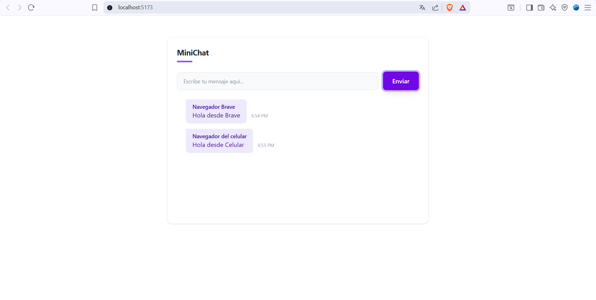

# MiniChat - Socket.IO

Este es el primer proyecto del curso de React con Socket.IO. Consiste en una aplicación de chat en tiempo real que permite a múltiples usuarios comunicarse instantáneamente.

## Descripción

El proyecto utiliza una arquitectura cliente-servidor para gestionar la comunicación bidireccional:
- **Backend:** Node.js con Express y Socket.IO para el manejo de eventos y conexiones.
- **Frontend:** Vite (Vanilla JS) con Tailwind CSS para una interfaz moderna y responsiva.

**Funcionalidades principales:**
- Comunicación en tiempo real (WebSockets).
- Historial de mensajes persistente (en memoria).
- Identificación de usuarios mediante alias.

## Imágenes



## Instalación

Instala las dependencias en ambas carpetas:

```bash
cd server && npm install
cd frontend && npm install
```

## Desarrollo

Para ejecutar la aplicación en modo de desarrollo, necesitas levantar tanto el backend como el frontend en terminales separadas.

**Backend:**
```bash
cd server
npm run dev
```

**Frontend:**
```bash
cd frontend
npm run dev
```

## Compilación (Build)

Para generar la versión optimizada de producción del frontend:

```bash
cd frontend
npm run build
```

## Producción

Para ejecutar el servidor en un entorno de producción:

```bash
cd server
node index.js
```
